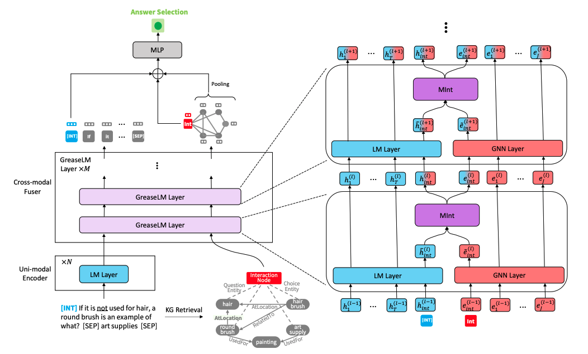

# GreaseLM: Graph REASoning Enhanced Language Models for Question Answering

This repo provides the source code & data of our paper [GreaseLM: Graph REASoning Enhanced Language Models for Question Answering](https://arxiv.org/abs/2201.08860) (ICLR 2022 spotlight). If you use any of our code, processed data or pretrained models, please cite:
```bib
@inproceedings{zhang2021greaselm,
  title={GreaseLM: Graph REASoning Enhanced Language Models},
  author={Zhang, Xikun and Bosselut, Antoine and Yasunaga, Michihiro and Ren, Hongyu and Liang, Percy and Manning, Christopher D and Leskovec, Jure},
  booktitle={International Conference on Learning Representations},
  year={2021}
}
```

<p align="center">
  
</p>

## 1. Dependencies

- [Python](<https://www.python.org/>) == 3.8
- [PyTorch](<https://pytorch.org/get-started/locally/>) == 1.8.0
- [transformers](<https://github.com/huggingface/transformers/tree/v3.4.0>) == 3.4.0
- [torch-geometric](https://pytorch-geometric.readthedocs.io/) == 1.7.0

Run the following commands to create a conda environment (assuming CUDA 10.1):
```bash
conda create -y -n greaselm python=3.8
conda activate greaselm
pip install numpy==1.18.3 tqdm
pip install torch==1.8.0+cu101 torchvision -f https://download.pytorch.org/whl/torch_stable.html
pip install transformers==3.4.0 nltk spacy
pip install wandb
conda install -y -c conda-forge tensorboardx
conda install -y -c conda-forge tensorboard

# for torch-geometric
pip install torch-scatter==2.0.7 -f https://pytorch-geometric.com/whl/torch-1.8.0+cu101.html
pip install torch-cluster==1.5.9 -f https://pytorch-geometric.com/whl/torch-1.8.0+cu101.html
pip install torch-sparse==0.6.9 -f https://pytorch-geometric.com/whl/torch-1.8.0+cu101.html
pip install torch-spline-conv==1.2.1 -f https://pytorch-geometric.com/whl/torch-1.8.0+cu101.html
pip install torch-geometric==1.7.0 -f https://pytorch-geometric.com/whl/torch-1.8.0+cu101.html
```


## 2. Download data

### Download and preprocess data yourself
**Preprocessing the data yourself may take long, so if you want to directly download preprocessed data, please jump to the next subsection.**

Download the raw ConceptNet, CommonsenseQA, OpenBookQA data by using
```
./download_raw_data.sh
```

You can preprocess these raw data by running
```
CUDA_VISIBLE_DEVICES=0 python preprocess.py -p <num_processes>
```
You can specify the GPU you want to use in the beginning of the command `CUDA_VISIBLE_DEVICES=...`. The script will:
* Setup ConceptNet (e.g., extract English relations from ConceptNet, merge the original 42 relation types into 17 types)
* Convert the QA datasets into .jsonl files (e.g., stored in `data/csqa/statement/`)
* Identify all mentioned concepts in the questions and answers
* Extract subgraphs for each q-a pair

The script to download and preprocess the [MedQA-USMLE](https://github.com/jind11/MedQA) data and the biomedical knowledge graph based on Disease Database and DrugBank is provided in `utils_biomed/`.

### Directly download preprocessed data
For your convenience, if you don't want to preprocess the data yourself, you can download all the preprocessed data [here](https://drive.google.com/drive/folders/1T6B4nou5P3u-6jr0z6e3IkitO8fNVM6f?usp=sharing). Download them into the top-level directory of this repo and unzip them. Move the `medqa_usmle` and `ddb` folders into the `data/` directory.

### Resulting file structure

The resulting file structure should look like this:

```plain
.
├── README.md
├── data/
    ├── cpnet/                 (prerocessed ConceptNet)
    ├── csqa/
        ├── train_rand_split.jsonl
        ├── dev_rand_split.jsonl
        ├── test_rand_split_no_answers.jsonl
        ├── statement/             (converted statements)
        ├── grounded/              (grounded entities)
        ├── graphs/                (extracted subgraphs)
        ├── ...
    ├── obqa/
    ├── medqa_usmle/
    └── ddb/
```

## 3. Training GreaseLM
To train GreaseLM on CommonsenseQA, run
```
CUDA_VISIBLE_DEVICES=0 ./run_greaselm.sh csqa --data_dir data/
```
You can specify up to 2 GPUs you want to use in the beginning of the command `CUDA_VISIBLE_DEVICES=...`.

Similarly, to train GreaseLM on OpenbookQA, run
```
CUDA_VISIBLE_DEVICES=0 ./run_greaselm.sh obqa --data_dir data/
```

To train GreaseLM on MedQA-USMLE, run
```
CUDA_VISIBLE_DEVICES=0 ./run_greaselm__medqa_usmle.sh
```

## 4. Pretrained model checkpoints
You can download a pretrained GreaseLM model on CommonsenseQA [here](https://drive.google.com/file/d/1QPwLZFA6AQ-pFfDR6TWLdBAvm3c_HOUr/view?usp=sharing), which achieves an IH-dev acc. of `79.0` and an IH-test acc. of `74.0`.

You can also download a pretrained GreaseLM model on OpenbookQA [here](https://drive.google.com/file/d/1-QqyiQuU9xlN20vwfIaqYQ_uJMP8d7Pv/view?usp=sharing), which achieves an test acc. of `84.8`.

You can also download a pretrained GreaseLM model on MedQA-USMLE [here](https://drive.google.com/file/d/1j0QxiBiGbv0s9PhseSly6V6uiHWU5IEt/view?usp=sharing), which achieves an test acc. of `38.5`.

## 5. Evaluating a pretrained model checkpoint
To evaluate a pretrained GreaseLM model checkpoint on CommonsenseQA, run
```
CUDA_VISIBLE_DEVICES=0 ./eval_greaselm.sh csqa --data_dir data/ --load_model_path /path/to/checkpoint
```
Again you can specify up to 2 GPUs you want to use in the beginning of the command `CUDA_VISIBLE_DEVICES=...`.

Similarly, to evaluate a pretrained GreaseLM model checkpoint on OpenbookQA, run
```
CUDA_VISIBLE_DEVICES=0 ./eval_greaselm.sh obqa --data_dir data/ --load_model_path /path/to/checkpoint
```
To evaluate a pretrained GreaseLM model checkpoint on MedQA-USMLE, run
```
INHERIT_BERT=1 CUDA_VISIBLE_DEVICES=0 ./eval_greaselm.sh medqa_usmle --data_dir data/ --load_model_path /path/to/checkpoint
```

## 6. Use your own dataset
- Convert your dataset to  `{train,dev,test}.statement.jsonl`  in .jsonl format (see `data/csqa/statement/train.statement.jsonl`)
- Create a directory in `data/{yourdataset}/` to store the .jsonl files
- Modify `preprocess.py` and perform subgraph extraction for your data
- Modify `utils/parser_utils.py` to support your own dataset

## 7. Acknowledgment
This repo is built upon the following work:
```
QA-GNN: Question Answering using Language Models and Knowledge Graphs
https://github.com/michiyasunaga/qagnn
```
Many thanks to the authors and developers!
